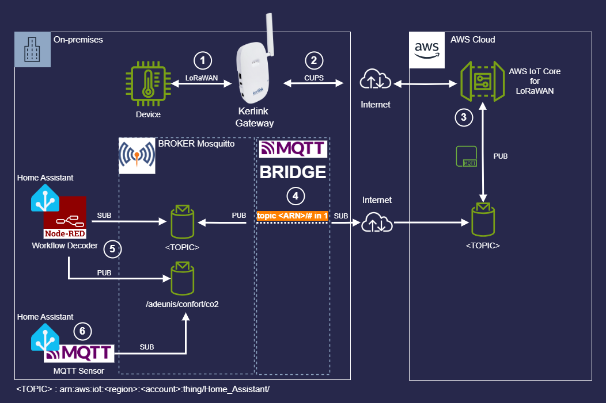
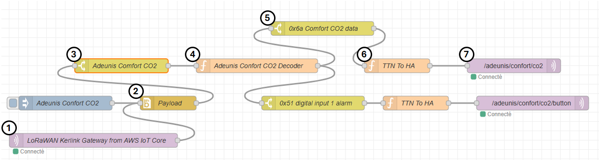

# Kerlink-LoRaWAN-To-AWS-IoT-Core

This guide provides detailed instructions on how to convert an HNT Kerlink Gateway into a private LoRaWAN Gateway and connect it to AWS IoT Core for LoRaWAN.

In the first part, you will learn how to convert your HNT Kerlink Gateway into a private LoRaWAN Gateway and establish a connection between your newly converted gateway and AWS IoT Core.

The second part of this guide explains how to attach your LoRaWAN device to AWS IoT Core **LNS** (**L**oRaWAN **N**etwork **S**erver) and forward the payload message to an MQTT Bridge. It also covers how a Node-Red flow is used to decode the message and how to forward the decoded message to Home Assistant via an MQTT Topic, enabling the ingestion of the JSON payload into MQTT Sensor entities.

## Architecture Schema



- [Kerlink-LoRaWAN-To-AWS-IoT-Core](#kerlink-lorawan-to-aws-iot-core)
  - [Architecture Schema](#architecture-schema)
  - [How to Convert an HNT Kerlink Gateway into a Simple LoRaWAN Gateway](#how-to-convert-an-hnt-kerlink-gateway-into-a-simple-lorawan-gateway)
  - [AWS IoT Core Settings](#aws-iot-core-settings)
    - [Prerequisites](#prerequisites)
      - [Retreive Kerlink Gateway'EUI](#retreive-kerlink-gatewayeui)
      - [Create IAM Role](#create-iam-role)
    - [Adding the Gateway to AWS IoT Core Service](#adding-the-gateway-to-aws-iot-core-service)
  - [Kerlink gateway settings](#kerlink-gateway-settings)
    - [Prepare credentials for Basic Station](#prepare-credentials-for-basic-station)
    - [Install certificates](#install-certificates)
    - [Enable the credentials by SSH](#enable-the-credentials-by-ssh)
  - [Adding Device to AWS IoT Core](#adding-device-to-aws-iot-core)
    - [Profiles](#profiles)
      - [Device Profile](#device-profile)
      - [Service Profile](#service-profile)
    - [Destination](#destination)
      - [IAM Role](#iam-role)
    - [Device Settings](#device-settings)
  - [Home Assistant](#home-assistant)
    - [Node-RED Flow](#node-red-flow)
    - [MQTT Sensor Integration](#mqtt-sensor-integration)
  - [References](#references)

## How to Convert an HNT Kerlink Gateway into a Simple LoRaWAN Gateway

Before starting this project, I contacted Kerlink Support to ask if it is possible to convert an HNT Wirnet iFemtoCell Kerlink Gateway into a simple Gateway. The support team confirmed that it is possible to replace the HNT firmware with standard firmware. I noticed that many HNT gateways are available on the second-hand market, so I bought one for only €80.

A few days later, I received the gateway and started resetting it to factory configuration. I was able to connect to the local console using the admin account and the default password, but I was unable to connect via SSH to the root account. The password did not seem to follow the default format, which is composed of a prefix and the last 6 digits of the serial number, like pdmk-0507DD.

After many hours of reading the support documentation and performing numerous reset operations, I concluded that the gateway had been wiped, but the root account seemed to be restricted to Kerlink support.

Then, I wrote to the support to ask them what the process is to wipe an HNT Gateway to convert it into a simple gateway. The support team informed me that they can activate a magic link to allow the gateway to retrieve a new firmware version from their servers, but this operation is irreversible. Then, I confirmed that I was aware of the irreversibility and that this is what I wanted.

After a latest physical reset button procedure, the gateway finally retrieved the correct firmware version, and it was possible to connect to it with the root account.

## AWS IoT Core Settings

Before proceeding with the Kerlink gateway settings, we need to add the gateway on the AWS side.

### Prerequisites

Before adding the gateway to AWS, some steps need to be accomplished, such as creating a specific IAM role and retrieving the physical gateway's EUI.

#### Retreive Kerlink Gateway'EUI

Below is the procedure to retreive the Kerlink gateway's EUI :

- Connect to the gateway via SSH
- Run the command :
  
``` bash
cat /tmp/board_info.json
```

- Retreive the value of the attribut **EUI64** and keep it for later

#### Create IAM Role

Before adding your gateway, you need to create a specific IAM role to allow the Configuration and Update Server (CUPS) to manage gateway credentials. This IAM role will be referenced later when you add the gateway. It is unnecessary to document the procedure in detail here, simply follow the AWS documentation : [Add an IAM role to allow the Configuration and Update Server (CUPS) to manage gateway credentials](https://docs.aws.amazon.com/iot-wireless/latest/developerguide/lorawan-rfregion-permissions.html#lorawan-onboard-permissions)

> ℹ️ The Configuration and Update Server (CUPS) is a central service that manages gateway credentials and configurations for AWS IoT Core. It facilitates secure communication between the gateway and AWS IoT Core by handling certificate management and updates. The CUPS server ensures that gateways are properly authenticated and authorized to connect to AWS IoT Core, providing a reliable and secure mechanism for managing IoT devices.

### Adding the Gateway to AWS IoT Core Service  

Connect to the management console of your prefered region where you want to handle your gatway and go to AWS IoT Core :

- Navigate to : `Manage > LPWAN Devices > Gateways :`
- Click `Add gateway`
- Fill in the `Gateway's EUI` with the value retreived earlier
- Set the correct `Frequence band` corresponding to your Radio Frequence Region (e.g., **EU868** for Europe)
- Click `Add gateway` to save the settings

In the next section :

- Click `Create certificate`
- Click `Download certificates files`
  
> 💡Safely keep the Private Key and the certificate file. The X.509 Certificate will be used by the Gateway to connect to AWS IoT Core via the CUPS Server

- Copy the CUPS endpoint that will be used by the **Basic Station** to connect to AWS IoT Core : `https://xxxxxxxxxxx.cups.lorawan.eu-west-1.amazonaws.com:443`
- In the `Gateway permissions` section, select the IAM Role that you created earlier **IoTWirelessGatewayCertManagerRole**

> ℹ️ The Basic Station is a modern protocol designed for LoRaWAN gateways to ensure secure and reliable communication with network servers. It uses WebSockets for communication, which provides enhanced security and stability. The protocol supports features like remote configuration, firmware updates, and secure authentication, making it easier to manage and maintain gateways. By using Basic Station, gateways can efficiently handle data transmission and ensure that they are always up-to-date with the latest configurations and security measures.
>
> *System overview of LoRa Basic Station* :
> 


## Kerlink gateway settings

Now that the gateway is correctly referenced by AWS IoT Core, we need to configure some settings on the Kerlink Gateway, such as the CUPS endpoint and the X.509 Certificate, which is used as credentials.

### Prepare credentials for Basic Station

Basic Station only recognize certificates and keys with specific names, so you need to rename the files as follow:

- Rename the *.cert.pem file as cups.crt
- Rename the *.private.key file as cups.key

### Install certificates

Upload your credential files by scp in the **/user/basic_station/etc** folder of the gateway.

### Enable the credentials by SSH

To enable your credentials, connect on the gateway by
SSH and type the following command :

``` bash
klk_bs_config --enable --cups-uri "https://xxxxxxxxxxx.cups.lorawan.eu-west-1.amazonaws.com:443"
```

Output of the command :

``` log
Set CUPS URI: https://xxxxxxxxxxx.cups.lorawan.eu-west-1.amazonaws.com:443
Stopping lorad 2.3.0
Set default lorad regplan: EU868-FR
Starting lorad 2.3.0
Restarting Basic Station
```

Now, if you return to the AWS IoT Core Management Console, you can verify that your gateway is successfully connected and operational. In the upcoming section, we will delve into the configuration and attachment of devices to AWS IoT Core, as well as the process for forwarding messages to Home Assistant.

## Adding Device to AWS IoT Core

The aim of this project is to progressively migrate all my LoRaWAN devices integrated from Helium to my own private LoRaWAN network. I intend to delegate the management of the LNS to AWS while forwarding messages to my on-premise Home Assistant. Therefore, before moving forward, I recommend reading this [post](https://github.com/vhuynen/Helium-Network-AWS-IoT-Core-Home-Assistant) to understand how to connect AWS IoT Core to Home Assistant over MQTT.

### Profiles

Before adding a new device to AWS IoT Core, you should configure the device and service settings that will be associated with your device.

#### Device Profile 

- Now, navigate to : `Manage > LPWAN Devices > Devices > Profiles`
- Click `Add device profile`
- Select `Select default profile` and choose `EU868-A-OTAA`
- Click `Add device profile`

#### Service Profile

- Now, navigate to : `Manage > LPWAN Devices > Devices > Profiles`
- Click `Add service profile`
- Fill in a `Name`
- Check the box : `Add gateway meta data`
- Do not activate the public network roaming if your device is fixed and you do not want to be charged for it.

### Destination 

- Navigate to : `Manage > LPWAN Devices > Devices > Destinations`
- Click `Add destination`
- Fill in a `Name`
- Choose the choose option `Publish to AWS IoT Core message broker` 
- Enter the topic destination : `arn:aws:iot:<region>:<account>:thing/Home_Assistant/`
- In the section `Permissions` select `Create a new service role`
- click `Save`

> 💡 In my case, I want to forward all messages received from my Gateway to Home Assistant which listens on the same topic that the topic destination.

#### IAM Role

If you want to use the same IAM Role for other destinations, I advice you to create own. For that, follow the [offical AWS IoT Core documentation](https://docs.aws.amazon.com/iot-wireless/latest/developerguide/lorawan-create-destinations.html#lorawan-create-destination-console).

### Device Settings

Now that you have all the prerequisite settings, you can add your device :

- Navigate to : `Manage > LPWAN Devices > Devices`
- Select `Add wireless device`
- Select `Wireless device specification` value `OTAA v1.0.x`
- Enter the same values `DevEUI`, `AppKey` and `AppEUI` according to your device
- Fill in a `Name`
- Select the device and service profile and destination as defined previously
- Finally, click `Save`

> Your device is now ready to join your LoRaWAN Network. You can then reboot your device to initiate the join procedure. If everything is correct, you can verify the device traffic in the `Device traffic` tab within the details of your device.  

## Home Assistant

Now that your device can send payload messages to Home Assistant, you need to configure some settings on the Home Assistant side.

### Node-RED Flow

Each data frame retrieved from the Kerlink Gateway is processed by a [Node-Red flow](./source/Node-Red/lorawan-node-red-flow.json).



1. The flow listens the Topic `arn:aws:iot:<region>:<account>:thing/Home_Assistant/`
2. The payload is decoded from Base64 to Buffer using the specific module function [node-red-node-base64](https://flows.nodered.org/node/node-red-node-base64)
3. A `switch` node routes the flow based on `msg.payload.WirelessDeviceId`
4. The `msg.payload.PayloadData` is decoded by a specific JavaScript function according to the payload device.
5. In Progress... 

> 💡 For more information on how to use a LoRaWAN Decoder on Node-Red, you can refer to this [tutorial](https://support.milesight-iot.com/support/solutions/articles/73000535734-how-to-use-decoder-on-node-red)

### MQTT Sensor Integration

## References

- Official [AWS IoT Core for LoRaWAN](https://docs.aws.amazon.com/iot-wireless/latest/developerguide/iot-lorawan.html) documentation
- [LoRa Basics Station](https://doc.sm.tc/station/howtouse.html) documentation
- [Getting started with Kerlink gateways AWS IoT Core for LoRaWAN](https://wikikerlink.fr/wirnet-productline/lib/exe/fetch.php?media=wiki:lora:1-getting_started_with_kerlink_gateways_aws_iot_core_for_lorawan-v2.0.pdf)

If you appreciate my job, please don’t hesitate to star ⭐ it and feel free to provide your feedback !
